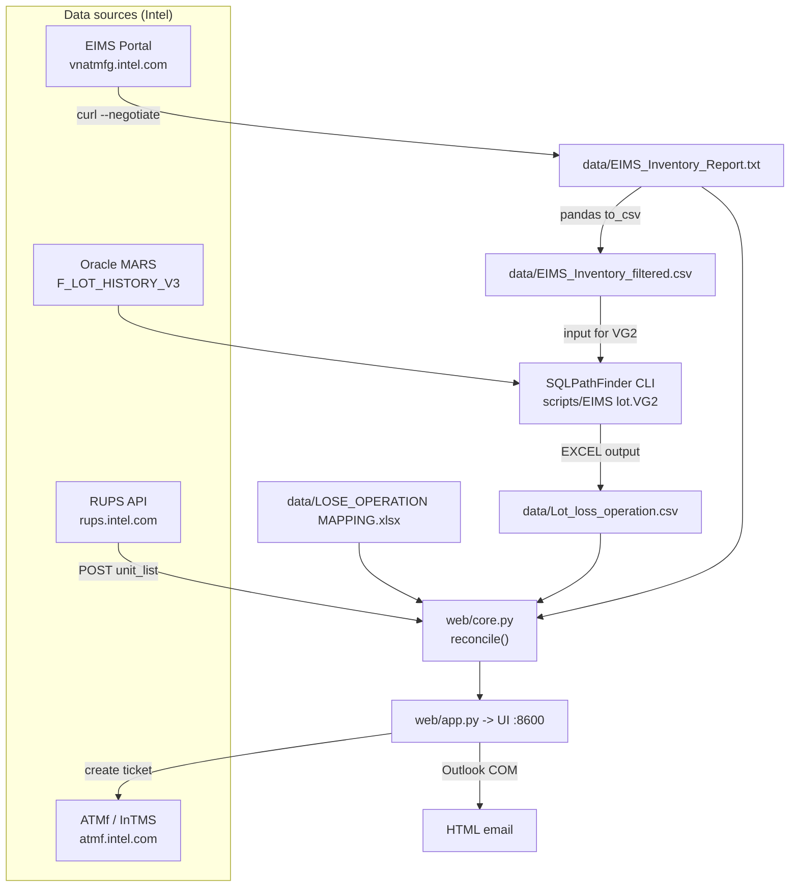

# WORKFLOW.md — Reject Management (EIMS ↔ RUPS ↔ MARS ↔ ATMf)

Complete reference: every workflow, every step, and the input/output of every script.
Last updated & verified: **2026-09-09** (full health check PASSED).

---

## 0. TL;DR — Running the app

```bat
run_web.bat
```
or

```powershell
cd "C:\Users\ngocluup\Desktop\Projects\Unit management"
& "C:\Users\ngocluup\AppData\Local\miniforge3\envs\ngocluup\python.exe" web\app.py 8600
```

| Item | Value |
|---|---|
| Local URL | http://localhost:8600 |
| Share URLs (Intel net/VPN) | http://NGOCLUUP-ILIS09:8600 · http://ngocluup-iLIS09.ger.corp.intel.com:8600 · http://10.88.183.105:8600 |
| Interpreter | `C:\Users\ngocluup\AppData\Local\miniforge3\envs\ngocluup\python.exe` (Python 3.14) |
| Server | Flask + waitress, 8 threads, `host=0.0.0.0` |
| Auto refresh | 07:00 Vietnam time (UTC+7) every day |

> **Prerequisites:** the host must be joined to the Intel domain with VPN connected
> (Kerberos SSO for EIMS/ATMf), and Outlook desktop must be running for the email feature.

---

## 1. System architecture



**Core principles:**
- The web app **only reads cached files** in `data/` — it never hits a database when a user clicks.
- All heavy work (EIMS download + MARS query + RUPS) runs **once per day at 07:00**, cached for 24h.
- User clicks are served straight from cache (~0.02s).

---

## 2. Directory layout

| Path | Role |
|---|---|
| `web/core.py` | **All backend logic** (RUPS, EIMS, MARS/SPF, ATMf, email). Pure Python, no Flask. |
| `web/app.py` | Flask JSON API + scheduler + waitress server. |
| `web/templates/index.html` | Single-page UI. |
| `web/static/app.js` | All frontend logic (API fetches, table rendering, multi-select). |
| `web/static/style.css` | Light/dark themes, glassmorphism. |
| `scripts/EIMS lot.VG2` | SQLPathFinder query grid → MARS. **Critical file, do not hand-edit.** |
| `scripts/export_eims_inventory.py` | Standalone EIMS downloader (stdlib-only, for use without the web app). |
| `scripts/rups_data.py` | Standalone RUPS query script. |
| `scripts/eims_lot_history.sql`, `build_lot_sql.py` | SQL rewrite of the VG2 (fallback, currently NOT usable — missing DB grant). |
| `data/` | All cache/mapping files. |
| `output/` | Scratch files (ATMf request bodies, email HTML, SPF logs). |
| `streamlit_backup/` | Old Streamlit app (backup, port 8501). No longer used. |

---

## 3. Data files — Input/Output

| File | Source | Format | Key columns | Current size |
|---|---|---|---|---|
| `data/EIMS_Inventory_Report.txt` | EIMS portal (curl) | **Tab-delimited** | `LotNumber`, `Operation`, `Quantity`, `Product`, `Mgr_Name`, `Department`, `Prodgroup3`, `Days_At_Operation` | 2.4 MB — **13,497 lots** |
| `data/EIMS_Inventory_filtered.csv` | derived from the file above | **Comma** | LotNumber must be **column 2** (VG2 reads `:2. LotNumber`) | 2.4 MB |
| `data/Lot_loss_operation.csv` | MARS via SPF | Comma | `LOT, CREATE_DATA1..4, INQTY` | 1.85 MB — 51,709 rows / **10,157 lots** |
| `data/LOSE_OPERATION MAPPING.xlsx` | manual | Excel | `Operation` \| `Domain` \| `PI Dispose` | 10 entries |
| `data/intms_products.json` | manual | JSON array | ATMf product names | **432 products** |

---

## 4. WORKFLOW A — Data refresh (automatic at 07:00, or the Refresh button)

Orchestrator: `_daily_refresh_loop()` in [web/app.py](web/app.py) · endpoint `POST /api/refresh`.

### Step A1 — Download EIMS
- **Function:** `core.download_eims()`
- **Command:** `curl.exe -s -S --negotiate -u : --fail -o data\EIMS_Inventory_Report.txt <EIMS_URL>`
- **Auth:** Kerberos SSO (`--negotiate -u :`) — **no password required**
- **URL:** `https://vnatmfg.intel.com/vf-rims-portal/home/vnat/EIMS_Inventory_Report.txt`
- **Input:** none · **Output:** the .txt file (tab-delimited), returns byte count
- **Common failure:** `curl failed (exit 22)` → VPN dropped or the Kerberos ticket expired.

### Step A2 — Refresh loss-operation data from MARS
- **Function:** `core.refresh_loss_operation(timeout=600)`
- Three sub-steps:
  1. Read `EIMS_Inventory_Report.txt` (tab) → write `EIMS_Inventory_filtered.csv` (comma).
     *This is the lot list the VG2 consumes as input.*
  2. Launch via `subprocess.Popen`:
     ```
     sqlpathfinder3.exe /run /minimize /log /startdir=output\spf_run "scripts\EIMS lot.VG2"
     ```
  3. **Poll every 5 seconds**: complete when `Lot_loss_operation.csv` has a newer mtime
     **AND** `sqlpathfinder3.exe` has disappeared from `tasklist`.
- **Output:** `(True, "Loss-operation refreshed (N bytes).")`
- **Duration:** ~2–4 minutes (two MARS nodes)
- **Log:** `output/spf_run/EIMSlot.log2`

> ⚠️ **NEVER kill `sqlpathfinder3.exe` / `SPFSQL3.py` while it is running** —
> the output file will be truncated (this happened on 2026-09-08: the file was left with 9 rows).

**Query details inside the VG2:**
| Item | Value |
|---|---|
| Nodes | `VN.[A90_PROD_27.].MARS`, `VN.[A90_PROD_28.].MARS` (172.19.95.73 / .74, port 1521, SERVICE_NAME `MARS_SRVC`) |
| Table | `F_Lot_History_v3` |
| Columns | `lot, create_data1, create_data2, create_data3, create_data4, inqty` |
| Filter 1 | `a0.lot Like Group` ← `data\EIMS_Inventory_filtered.csv:2. LotNumber` |
| Filter 2 | `a0.prevout_date >= TRUNC(SYSDATE) - 360` |
| Output | `EXCEL:` → `data\Lot_loss_operation.csv` |
| Auth | SPF uses **its own MARS service account**. Personal Kerberos identities have no grant (ORA-00942). |

### Step A3 — Clear caches
- **Function:** `core.clear_caches()` → clears the EIMS dataframe, mapping, RUPS, and reconcile caches.

### Step A4 — Pre-warm
- **Function:** `_prewarm()` → pre-computes `reconcile()` for the default view, both scopes
  (`all` + `critical`) so the first user gets instant results.

---

## 5. WORKFLOW B — Reconciliation (the core business logic)

Endpoint: `POST /api/reconcile` → `core.reconcile()` → `core._reconcile_impl()`

### Step B1 — Filter EIMS
`core.apply_filters(df, products, selected)`

**Default filters** (`DEFAULT_FILTERS`):
| Column | Values |
|---|---|
| Operation | `7000` |
| Mgr_Name | Bui Anh Huy, Dong Dang Phu, Le Thanh Loc, Nguyen Dang Hai, Nguyen Duc Loc, Sky Tran |
| Department | A/T MFG, VNAT TEG-T |
| Prodgroup3 | ADLN, ARLR816B, ARLS816B, ARLU281, ASL, BMG21, BTL12P, GRR, MTLU281, NVLH, NVLHX, RPLP282, RPLP282IOTG, RPRP282, TWL |

- View **"Op 7000"** = default filters · View **"Op 4000"** = `Operation=4000`, all products.
- **Scope:** `all` (everything) or `critical` (`Days_At_Operation > 60`).
- 13,497 lots → **1,934 lots** after the default filters.

### Step B2 — Query RUPS
- **Function:** `core.query_units(lots)`
- **Endpoint:** `POST https://rups.intel.com/RUPS_api`
- **Headers:** `SITE: VNAT`, `TOKEN: <token>`, `WWID: <wwid>` ← **sensitive credentials**
- **Body:** `{"api": "CUSTOMIZED_API_SEARCH_UNIT_INFO", "unit_list": "lot1,lot2,..."}`
- **Timeout:** 240s · **Cache:** 24h, keyed on the sorted lot tuple
- **Response:** `return.data = [[{...}], []]` → flatten

> 🔑 **RUPS returns ONE ROW PER UNIT (VID).** The `QUANTITY` column is lot-level and is
> **repeated on every row** → **NEVER `sum()` it.**
> Correct count: `df.groupby(lot)["VID"].nunique()`

### Step B3 — Quantity reconciliation
| Metric | Derivation |
|---|---|
| `EIMS_Qty` | `sum(Quantity)` per lot from EIMS |
| `RUPS_Qty` | `nunique(VID)` per lot from RUPS |
| `status` | `Match` if equal · `MISMATCH` if different · `Not found` if absent from RUPS |

A difference between EIMS and RUPS **is business-valid** — the app deliberately surfaces it for review.

### Step B4 — Determine Operation & PI Dispose
Priority: **RUPS `LOSE_OPERATION` first, MARS `CREATE_DATA3` second.**

```
lose_s = strip_via(RUPS.LOSE_OPERATION)      # drops the " VIA xxxx" suffix
cd3_s  = strip_via(MARS.CREATE_DATA3)
if both present  -> use lose_s, flag op_conflict when they differ
if only lose     -> use lose_s
otherwise        -> use cd3_s
```

- `strip_via("7226 VIA 1438")` → `"7226"`
- `map_pi_dispose()`: contains `7226` → **`Eng_Assessment`**; otherwise look up `LOSE_OPERATION MAPPING.xlsx`

**`load_inqty_map()` — two bugs fixed on 2026-09-09:**
1. `drop_duplicates()` before summing `INQTY` — MARS returns the same row **once per node**,
   so without this the quantity is **doubled**.
2. `CREATE_DATA3`: **keep the FIRST NON-BLANK value** per lot.
   *(The old code used `dict(zip(...))`, so the last row won — and blank rows usually come last,
   which wiped out every value.)*

### Step B5 — PPV / Class classification
- **From RUPS `SSPEC`:** non-empty = PPV, empty = Class (used for unit-level metrics).
- **From EIMS `Product`:** `product_has_sspec()` — last token longer than 1 character = PPV
  (used for the summary table).

### Step B6 — Group the results
`products[] → groups[] (by PI: PPV → Class → Eng_Assessment) → lots[]`
Sorting: MISMATCH first, then `last_used` descending.

**Verified results on 2026-09-09:**
```
lots 1934 · rups records 64,896
ppv_units 12,905 · class_units 51,991 · mismatch 413 · not_found 383
lots with Operation: 1908/1934 · with PI_Dispose: 1892/1934
```

---

## 6. WORKFLOW C — Creating ATMf (InTMS) tickets

Endpoint: `POST /api/atmf/submit` → `core.submit_tickets()`

### Step C1 — Create the ticket
```
POST https://atmf.intel.com/api/custom/ims/ticketing/
Body: {"signal": 221, "form_json": {...}}
Auth: curl.exe -s -k --negotiate -u :
```
> ⚠️ The host is **`atmf.intel.com`** (NOT `intms.intel.com`).
> Signal **221** = "Reject Management - POR". A wrong signal returns `"signal can not be found!"`.

**Form fields (signal 221):**
| Field | Valid values |
|---|---|
| Customer | CCG / PSG / DCG |
| Payer BU | ProdCo / TMGf / I'm not sure! |
| Product Stage | HVM / NPI / Not product specific / N/A |
| Product Name | one of the **432** values in `intms_products.json` |
| Test Area | PPV / Class / Burn In / OLB / Others |
| Factories | VNAT / CDAT / CRAT / KMAT8 / KuAT / PGAT / PG18 |
| Shipping/LYA/FA Only | Yes / No |
| NFO shipment | Yes / No |

### Step C2 — Fill in "Fill in required information*" (MANDATORY)
```
PATCH https://atmf.intel.com/api/custom/ims/actionflow/<ticket_id>/
Body: {"action_flow_json": {"id": "4", "rich_text": "<p>request</p><p>lot1</p><p>lot2</p>"}}
```
> ⚠️ `rich_text` sent at CREATE time **does NOT** reach action 4. The PATCH after creation is **required**.

**Request types:** `Scrap these lot` · `Transfer these lot to HVE Lab`
**Ticket URL:** `https://atmf.intel.com/intms/panel/detail/<id>`

### Step C3 — Product name auto-mapping
`core.guess_atmf_product()`: hard-coded `INTMS_PRODUCT_MAP` → prefix match (alphanumerics only)
→ `difflib` fuzzy match (cutoff 0.6).

| Prodgroup3 | Result | Note |
|---|---|---|
| ADLN | ADL N 0+8+1 | ✅ hard-coded map |
| ARLS816B | ARL S 8+16+1 | ✅ prefix match |
| TWL | WLW | ❌ **incorrect fuzzy match** — pick manually or add it to `INTMS_PRODUCT_MAP` |

> **Always double-check the Product Name in the UI before submitting.**

---

## 7. WORKFLOW D — Email report

| Endpoint | Function | Result |
|---|---|---|
| `POST /api/email/preview` | `core.build_report(summary)` | returns `subject` + HTML (light theme, inline CSS for Outlook) |
| `POST /api/email/open` | `core.send_via_outlook(..., display_only=True)` | **opens an Outlook compose window** (does not auto-send) |

- Mechanism: writes the HTML to `output/_email_body.html`, generates `output/_send_outlook.ps1`,
  and runs PowerShell against the Outlook COM object (`$mail.Display()`).
- Subject: `EIMS <-> RUPS Lot Reconciliation - YYYY-MM-DD (N lots)`
- Body: grouped per product, MISMATCH cells highlighted in red.
- **Requirement:** Outlook desktop must be running on the server machine.

---

## 8. API reference

| Method | Endpoint | Input | Output |
|---|---|---|---|
| GET | `/` | – | HTML page |
| POST | `/api/refresh` | – | `{ok, size, loss_ok, loss_msg, last_update}` |
| GET | `/api/options?view=default\|op4000` | – | `{options, preset, all_products}` |
| POST | `/api/summary` | `{products[], filters{}}` | `{total_rows, products[], n_products}` |
| POST | `/api/reconcile` | `{products[], filters{}, scope}` | `{lots, records, metrics{}, products[], summary[], not_found[]}` |
| GET | `/api/atmf/products` | – | `{products[]}` (432) |
| POST | `/api/atmf/guess` | `{prodgroups[]}` | `{map{}}` |
| POST | `/api/atmf/submit` | `{tickets[]}` | `{results[]}` |
| POST | `/api/email/preview` | – | `{subject, html}` |
| POST | `/api/email/open` | `{to, cc, subject}` | `{ok}` |

> Every response goes through `sjson()`, which converts NaN/Infinity to `null`
> (otherwise the browser throws a **"bad json"** error).

---

## 9. Caching

| Cache | Key | TTL | Cleared by |
|---|---|---|---|
| `_rups_cache` | sorted lot tuple | 24h | `clear_rups_cache()` |
| `_recon_cache` | `(scope, lot tuple)` | until the next refresh | `clear_recon_cache()` |
| `_eims_cache` | file mtime | automatic | mtime change |
| `_map_cache` | name ("lose"/"inqty"/"products") | unbounded | `clear_caches()` |

**Performance:** first run ~1.1s · cached ~0.02s.

---

## 10. Standalone scripts (manual use, no web app needed)

| Script | Run with | Input | Output |
|---|---|---|---|
| `scripts/export_eims_inventory.py` | `C:\Python27\python.exe` (stdlib-only) | – | `data/EIMS_Inventory_Report.csv` |
| `scripts/rups_data.py` | same | lot list from a file | unit CSV |
| `scripts/build_lot_sql.py` | miniforge python | EIMS CSV | SQL with the lot list injected |
| `scripts/eims_lot_history.sql` | – | `{{LOT_LIST}}` token | *(fallback — not usable yet, missing DB grant)* |

---

## 11. Pitfalls & common errors

| Symptom | Root cause | Fix |
|---|---|---|
| `CREATE_DATA3` all blank | `dict(zip())` overwrite bug | ✅ fixed — keep first non-blank value |
| INQTY doubled | MARS returns duplicate rows per node | ✅ fixed — `drop_duplicates()` |
| `Lot_loss_operation.csv` only a few rows | SPF was killed mid-run | Re-run `refresh_loss_operation()` and let it finish |
| Browser reports "bad json" | NaN present in the response | Use `sjson()`, never raw `jsonify` |
| ATMf "signal can not be found!" | Wrong signal / wrong host | Use signal **221** on **atmf.intel.com** |
| Ticket missing the lot list | actionflow was not PATCHed | Call `fill_intms_action(tid, 4, rich)` |
| `'list' object has no attribute 'get'` | API returns a list on error | Guard with `isinstance(data, dict)` |
| JS/CSS not updating | Browser cache | Already handled by `?v={{ asset_ver }}` (mtime) |
| ORA-00942 with oracledb | Personal account has no grant | Use the SPF CLI (current approach) |
| Filters pick up a "nan" value | `str(NaN) == "nan"` is truthy | Guard with `pd.notna(v) and str(v).strip().lower() != "nan"` |

---

## 12. Environment

```powershell
# Interpreter (there is NO python/python3 on PATH)
C:\Users\ngocluup\AppData\Local\miniforge3\envs\ngocluup\python.exe

# Installing packages — conda-forge ONLY (PyPI and github.com are blocked)
conda install -n ngocluup -y -c conda-forge pandas requests openpyxl flask waitress
```

**Installed:** pandas, requests, openpyxl, flask, waitress, oracledb 4.0.2, streamlit

> conda writes warnings to stderr, so PowerShell reports exit code 1 even on success.
> Verify with an import check instead of trusting the exit code.

**External paths:**
- SPF: `C:\Users\ngocluup\My Programs\SQLPathFinder3\sqlpathfinder3.exe`
- Oracle Instant Client 19.17: `...\SQLPathFinder3\Oracle\instantclient_19_17`

---

## 13. Daily operations checklist

1. Is the web app still running? → `Get-CimInstance Win32_Process -Filter "Name='python.exe'"`
2. Did the 07:00 auto-refresh run? → check the console log: `[scheduler] EIMS auto-refreshed ...`
3. Is the data fresh? → mtime of `data/EIMS_Inventory_Report.txt` and `data/Lot_loss_operation.csv`
4. Is it reachable on the LAN? → `Invoke-WebRequest http://10.88.183.105:8600/ -UseBasicParsing`

**Manual refresh:** click the Refresh button in the UI (runs both EIMS + MARS, takes 2–4 minutes).

---

## 14. Remaining work (Phase 2)

- Per-account permissions (only the owner sees the Refresh button).
- Submit ATMf tickets under **each user's own account**, not the host machine's.
- Extend `INTMS_PRODUCT_MAP` for codes that fuzzy-match incorrectly (starting with `TWL`).
